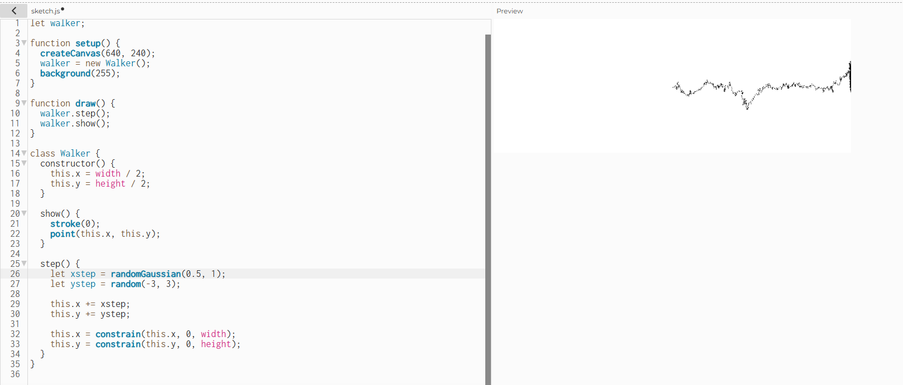

### Diferencia entre una distribución uniforme y una no uniforme de números aleatorios:
En el ejemplo de generación en la pagina se ve bastante claro esta diferencia, enves de tener una generación con una probabilidad arreglada y mucho más organizada la no uniforme llega al resultado de una linea por ejemplo
pero luego de que se genere por un periodo de tiempo pronlongado para que asi cada generación llene los pixeles de la pantalla y de forma a la linea.

### Codigo 
``` js
let walker;

function setup() {
  createCanvas(640, 240);
  walker = new Walker();
  background(255);
}

function draw() {
  walker.step();
  walker.show();
}

class Walker {
  constructor() {
    this.x = width / 2;
    this.y = height / 2;
  }

  show() {
    stroke(0);
    point(this.x, this.y);
  }

  step() {
    let xstep = randomGaussian(0.5, 1);  
    let ystep = random(-3, 3);           

    this.x += xstep;
    this.y += ystep;

    this.x = constrain(this.x, 0, width);
    this.y = constrain(this.y, 0, height);
  }
}
```

### Resultado

