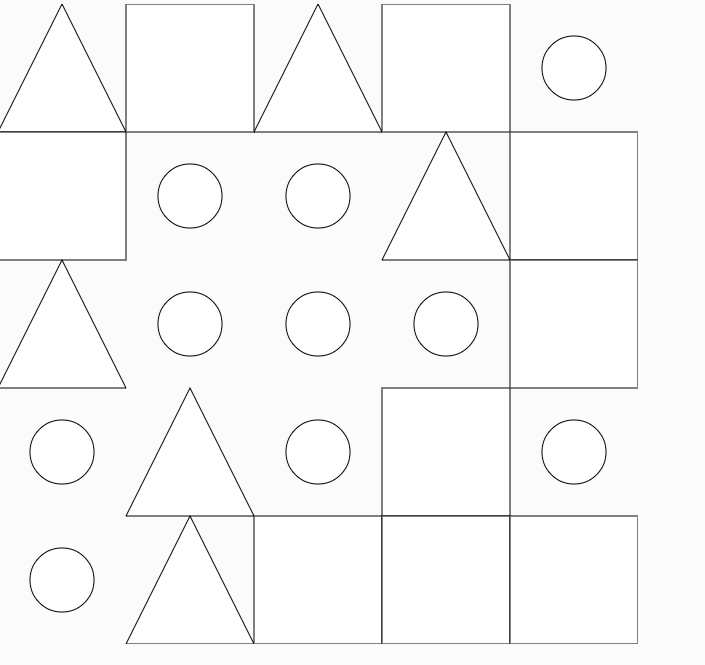

### Codigo
``` js
function setup() {
  createCanvas(640, 640);
  noLoop(); 
  let gridSize = 5;
  let cellSize = width / gridSize;
  
  for (let i = 0; i < gridSize; i++) {
    for (let j = 0; j < gridSize; j++) {
      let x = i * cellSize;
      let y = j * cellSize;
      let shapeType = int(random(1, 4)); 

    
      if (shapeType === 1) {
        drawCircle(x, y, cellSize);
      } else if (shapeType === 2) {
        drawTriangle(x, y, cellSize);
      } else if (shapeType === 3) {
        drawSquare(x, y, cellSize);
      }
    }
  }
}

function drawCircle(x, y, size) {
  ellipse(x + size / 2, y + size / 2, size / 2); 
}

function drawTriangle(x, y, size) {
  let halfSize = size / 2;
  triangle(
    x + halfSize, y, 
    x, y + size,     
    x + size, y + size 
  );
}

function drawSquare(x, y, size) {
  rect(x, y, size, size); 
}

//Cambios para una generación con distribución normal
function setup() {
  createCanvas(640, 640);
  noLoop(); 
  let gridSize = 5;
  let cellSize = width / gridSize;
  
  for (let i = 0; i < gridSize; i++) {
    for (let j = 0; j < gridSize; j++) {
      let x = i * cellSize;
      let y = j * cellSize;
      let shapeType = int(random(1, 4)); 

    
      if (shapeType === 1) {
        drawCircle(x, y, cellSize);
      } else if (shapeType === 2) {
        drawTriangle(x, y, cellSize);
      } else if (shapeType === 3) {
        drawSquare(x, y, cellSize);
      }
    }
  }
}

function drawCircle(x, y, size) {
  ellipse(x + size / 2, y + size / 2, size / 2); 
}

function drawTriangle(x, y, size) {
  let halfSize = size / 2;
  triangle(
    x + halfSize, y, 
    x, y + size,     
    x + size, y + size 
  );
}

function drawSquare(x, y, size) {
  rect(x, y, size, size); // Cuadrado en la celda
}

``` 

### Captura


### Explicación

En la visualización con p5.js, los valores generados con randomGaussian(0, 1) siguen una distribución normal, donde los valores cercanos a la media (0) son más frecuentes. 
Estos valores se normalizan a un rango de 1 a 3, asignando círculos, triángulos y cuadrados a las celdas. Como la distribución normal tiene mayor concentración en torno a la media,
 los círculos aparecen más en el centro de la cuadrícula, mientras que los triángulos y cuadrados se distribuyen hacia los bordes, reflejando visualmente la forma de campana de la distribución.
