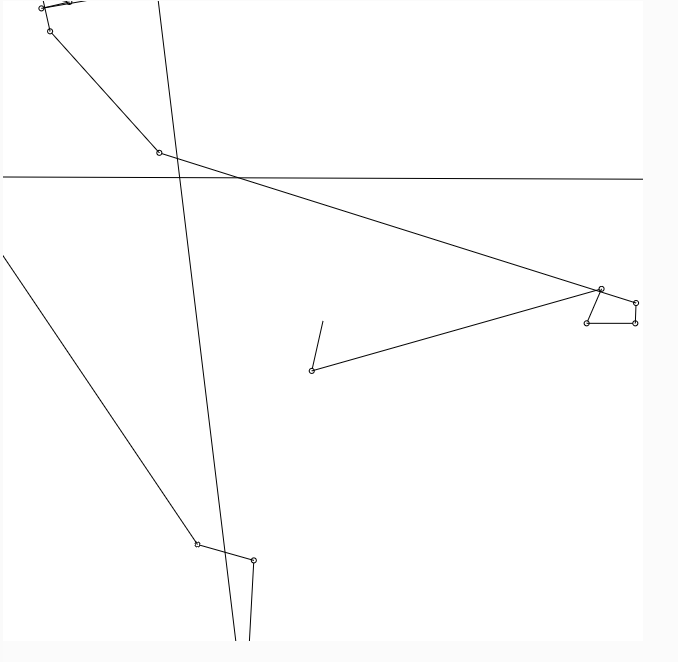

## Lévy flight

El Lévy flight es un tipo de movimiento aleatorio caracterizado por saltos largos y cortos distribuidos de manera no uniforme, siguiendo una distribución de probabilidad con cola pesada. 
A diferencia de la caminata aleatoria tradicional, los saltos en un Lévy flight tienen una mayor probabilidad de ser grandes. Este tipo de movimiento es útil en varios contextos:
-Búsqueda en entornos complejos
-Simulación de fenómenos naturales
-Redes de comunicación y tráfico de datos
-Algoritmos de optimización
El Lévy flight se aplica para modelar comportamientos de búsqueda eficientes, estudiar fenómenos naturales, optimizar redes y mejorar la exploración en algoritmos de optimización.

### Simulación

``` js
let x, y;

function setup() {
  createCanvas(640, 640);
  background(255);
  x = width / 2; 
  y = height / 2;
  frameRate(30); 
}

function draw() {
  let angle = random(TWO_PI); 
  let stepLength = levyStep(); 
  

  let newX = x + cos(angle) * stepLength;
  let newY = y + sin(angle) * stepLength;

  stroke(0);
  line(x, y, newX, newY); 
  ellipse(newX, newY, 5, 5); 
  

  x = newX;
  y = newY;
}


function levyStep() {

  return pow(random(1), -1.5) * 20; 
}

```

### Imagen

