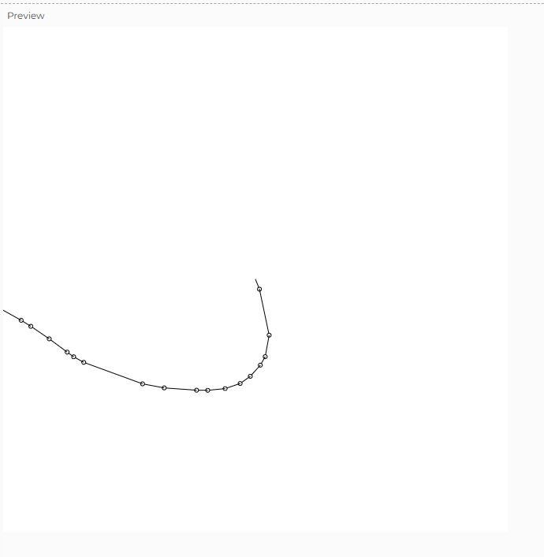
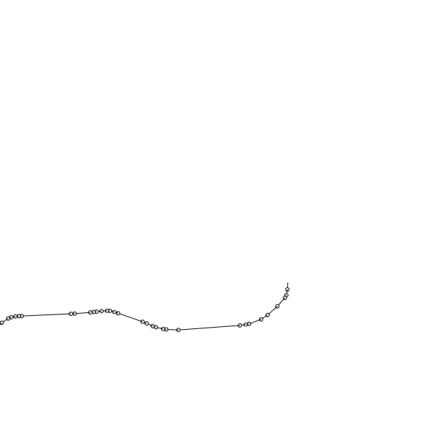

## Perlin Noise

### Figura 0-4
Vale como se nos dice en el texto la diferencia en estos 2 generadores es que gracias a Ken Perlin se tiene una generación con numeros cercanos al numero anterior haciendo asi que la generación aun siendo aleatoria 
sea mucho más suave y no de unos saltos grandes haciendo que la grafica se vea mucho menos erratica.

### Codigo
``` js
let x, y;
let t = 0; // Tiempo para el ruido Perlin
let stepSize = 4; // Reducir el tamaño de los saltos para que no lleguen rápido a los bordes

function setup() {
  createCanvas(840, 840);
  background(255);
  x = width / 2; // Inicio en el centro
  y = height / 2;
  frameRate(10); // Aumentamos la frecuencia de la simulación
}

function draw() {
  // Generamos una dirección usando el ruido Perlin
  let angle = noise(t) * TWO_PI; // Ruido Perlin para el ángulo (entre 0 y 2*PI)
  let stepLength = levyStep(); // Longitud del salto de Lévy
  
  // Calculamos las nuevas posiciones
  let newX = x + cos(angle) * stepLength;
  let newY = y + sin(angle) * stepLength;

  // Dibujamos la trayectoria
  stroke(0);
  line(x, y, newX, newY); // Línea entre la posición actual y la nueva
  ellipse(newX, newY, 5, 5); // Dibuja un pequeño círculo en la nueva posición
  
  // Actualizamos la posición
  x = newX;
  y = newY;
  
  // Actualizamos el tiempo para el ruido Perlin
  t += 0.05; // Incremento suave para cambiar la dirección
}

// Función para generar el salto de Lévy
function levyStep() {
  // Usamos una distribución de Lévy con un exponente de 1.5
  return pow(random(1), -1.5) * stepSize; // Ajuste el tamaño de los saltos para evitar que se mueva muy rápido
}
```
### Generaciones 





### Explicación
Gracias al ruido perlin se evidencia el cambio en la generación del walker con respecto a las actividades anteriores o con el salto de levyn, esto gracias a que los valores al ser similares generan formas muchos más suaves 
y permiten que la generación con unos valores adecuados se desplace lo suficiente para generar formas interesantes y que no llegue tan rapido a un limite.
