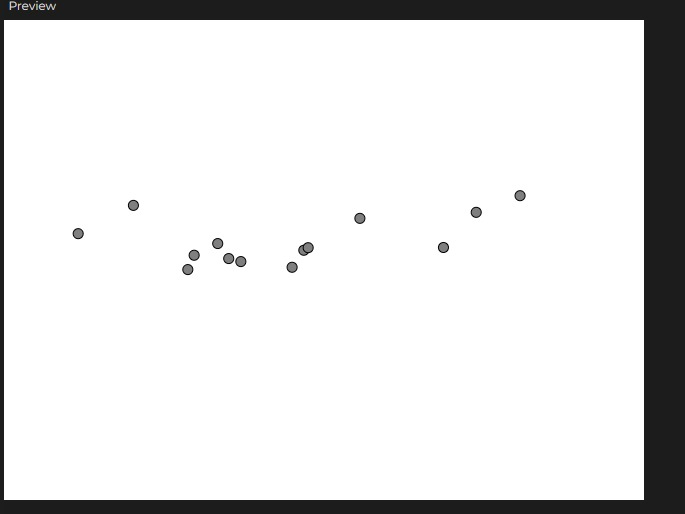

##  Materialización

### Variación?
En este caso al estar pensando en la idea y desarrollándola al mismo tiempo no hubo muchos cambios en la implementación fuera del cambio en código para solucionar errores.

### Codigo
``` js 
let vehicles = [];
let paths = [];
let debug = false;

function setup() {
  createCanvas(640, 480);
  paths.push(createPath());
  vehicles.push(new Vehicle(random(width), random(height), random(2, 5), random(0.1, 0.5)));
}

function draw() {
  background(255);
  
  
  if (debug) {
    for (let path of paths) {
      path.display();
    }
  }
  
  
  for (let vehicle of vehicles) {
    vehicle.follow(paths[vehicle.pathIndex]);
    vehicle.run();
  }
}

function mousePressed() {
  paths.push(createPath());
  vehicles.push(new Vehicle(mouseX, mouseY, random(2, 5), random(0.1, 0.5)));
}

function createPath() {
  let path = [];
  let xOff = random(0, 1000); // Inicio del ruido Perlin
  let yOff = random(0, 1000); 
  for (let x = 0; x < width; x++) {
    
    let y = map(noise(xOff, yOff), 0, 1, 0, height);

    
    y += gaussianNoise(x) * 20; 

    path.push(createVector(x, y));
    xOff += 0.05;
    yOff += 0.05;
  }
  return new Path(path);
}


function gaussianNoise(x) {
  return randomGaussian(); 
}


class Vehicle {
  constructor(x, y, maxSpeed, maxForce) {
    this.position = createVector(x, y);
    this.velocity = createVector(0, 0);
    this.acceleration = createVector(0, 0);
    this.maxSpeed = maxSpeed;
    this.maxForce = maxForce;
    this.pathIndex = paths.length - 1; 
    this.pathProgress = 0; 
  }

  applyForce(force) {
    this.acceleration.add(force);
  }

  follow(path) {
    
    this.pathProgress += 1;
    if (this.pathProgress >= path.points.length) {
      this.pathProgress = 0; 
    }

  
    let target = path.points[this.pathProgress];
    let desired = p5.Vector.sub(target, this.position);
    desired.normalize();
    desired.mult(this.maxSpeed);
    
    let steering = p5.Vector.sub(desired, this.velocity);
    steering.limit(this.maxForce);
    this.applyForce(steering);
  }

  run() {
    this.velocity.add(this.acceleration);
    this.velocity.limit(this.maxSpeed);
    this.position.add(this.velocity);
    this.acceleration.mult(0); 
    this.display();
  }

  display() {
    fill(127);
    stroke(0);
    ellipse(this.position.x, this.position.y, 10, 10); 
  }
}


class Path {
  constructor(points) {
    this.points = points;
  }

  display() {
    noFill();
    stroke(200);
    beginShape();
    for (let pt of this.points) {
      vertex(pt.x, pt.y);
    }
    endShape();
  }
}
```
### Captura del contenido generado


