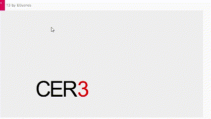

## Palabra elegida
Cer0
La idea es que hay una palabra al inicio que sea "cer1" o puede ser unos numeros más adelante que este empiece a bajar hasta que quede una O que simbolizaria el 0, y al final quedaria Cer0.
### Aspectos técnicos clave
Letras (estáticas):

Se crean como objetos simples en un arreglo letters con posiciones fijas (x, y).

Se dibujan con text() en drawLetters().

No tienen física: No son cuerpos de Matter.js, no reaccionan a gravedad o colisiones.

Número (físico):

Es un cuerpo rectangular de Matter.js (Bodies.rectangle).

Propiedades importantes:

isStatic: true al inicio (no se mueve hasta hacer clic).

restitution: 0.3 (rebote al chocar con el suelo).

Gravedad ajustada (engine.world.gravity.y = 1.5).

Restricciones:

No se usan restricciones (como resortes o joints) en este código.

El suelo (ground) es un cuerpo estático invisible que detiene el número.

## Codigo
``` js  
let Engine = Matter.Engine,
    World = Matter.World,
    Bodies = Matter.Bodies,
    Body = Matter.Body;

let engine;
let ground;
let letters = [];
let currentNumber;
let fadeAlpha = 255;
let nextY = -100;
let currentValue = 3;
let animationPhase = 0; // 0:espera, 1:cayendo, 2:transición

function setup() {
  createCanvas(800, 400);
  
  engine = Engine.create();
  engine.world.gravity.y = 1.5; // Gravedad más fuerte para mayor velocidad
  
  ground = Bodies.rectangle(width/2, height + 50, width, 100, { 
    isStatic: true, 
    render: { visible: false } 
  });
  World.add(engine.world, ground);
  
  createLetters();
  createNumber(currentValue);
}

function draw() {
  background(240);
  
  drawLetters();
  
  if (currentNumber) {
    drawCurrentNumber();
  }
  
  if (animationPhase === 2) {
    drawNextNumber();
  }
  
  updateNumbers(); // ¡Esta línea faltaba y es crucial!
  Engine.update(engine);
}

function mousePressed() {
  if (animationPhase === 0) {
    animationPhase = 1;
    Body.setStatic(currentNumber, false);
  }
}

function createNumber(value) {
  if (currentNumber) {
    World.remove(engine.world, currentNumber);
  }
  
  currentNumber = Bodies.rectangle(350, 300, 40, 120, {
    isStatic: true,
    restitution: 0.3,
    render: { visible: false }
  });
  World.add(engine.world, currentNumber);
  
  fadeAlpha = 255;
  animationPhase = 0;
  currentValue = value;
}

function updateNumbers() {
  if (animationPhase === 1 && currentNumber.position.y > height - 150) {
    fadeAlpha -= 15; // Desvanecimiento más rápido
    if (fadeAlpha <= 0) {
      startTransition();
    }
  }
  
  if (animationPhase === 2) {
    nextY += 8; // Movimiento más rápido del siguiente número
    if (nextY >= 300) {
      finishTransition();
    }
  }
}

function startTransition() {
  animationPhase = 2;
  nextY = -100;
}

function finishTransition() {
  if (currentValue > 0) {
    createNumber(currentValue - 1);
  } else {
    animationPhase = 3; // Fin de la animación
  }
}

function drawLetters() {
  letters.forEach(letter => {
    fill(0);
    textSize(80);
    textAlign(CENTER, CENTER);
    text(letter.char, letter.x, letter.y);
  });
}

function drawCurrentNumber() {
  fill(255, 0, 0, fadeAlpha);
  textSize(80);
  textAlign(CENTER, CENTER);
  text(currentValue, currentNumber.position.x, currentNumber.position.y);
}

function drawNextNumber() {
  fill(0, 0, 255, 255 - fadeAlpha);
  textSize(80);
  textAlign(CENTER, CENTER);
  text(currentValue - 1, 350, nextY);
}

function createLetters() {
  const posX = [200, 250, 300];
  posX.forEach((x, i) => {
    letters.push({
      x: x,
      y: 300,
      char: i === 0 ? 'C' : i === 1 ? 'E' : 'R'
    });
  });
}
``` 
## Gif

